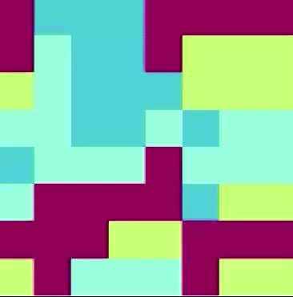

# Implementation of Axelrod's Cultural Diffusion Model

Welcome to the repository for the implementation of Axelrod's cultural diffusion model! This project contains the source code and tools necessary to simulate the process of cultural diffusion in a society using the Axelrod model. The Axelrod model is a popular mathematical method used in social sciences to study the interaction among agents and the spread of culture.
<br>
<br>

<br>

## About the Axelrod Model

The Axelrod model, named after Robert Axelrod, is based on the assumption that agents in a society have certain cultural preferences and interact with other agents. In each simulation step, agents randomly select one of their neighbors and compare their preferences with those of the selected neighbor. If the preferences are similar, agents begin to share their cultures.

### Getting Started
To use this implementation of Axelrod's cultural diffusion model, follow these steps:

**1. Installation:** Make sure you have Python installed on your system. <br>
Before using the Axelrod Model, ensure you have the following libraries installed:

- Mesa
- Numpy
- Matplotlib

You can install these libraries using the following command:

```
pip install mesa numpy matplotlib
```

Clone this repository to your local machine using:

```
git clone git@github.com:PeWeX47/Axelrod-Model.git
```

Navigate to the repository directory:

```
cd Axelrod-Model
```

**2. Running the Simulation:** The repository includes two way to run the simulation, from *simulation.ipynb* or *main.py*. Choose either of them to run the simulation based on your preference.

- *simulation.ipynb:* This Jupyter Notebook file provides an interactive environment to explore the Axelrod model's behavior and visualize the final result. 

- *main.py:* This Python script allows you to run the simulation in a non-interactive manner, but the simulation is displayed in real time.

Modify the parameters (*N, width, height, features, traits*) according to your preferences and observe the simulation's outcome.

### Credits
This model was created as a project for Distributed Systems course at my university. Feel free to contribute to the project by adding more features or improving the existing code.